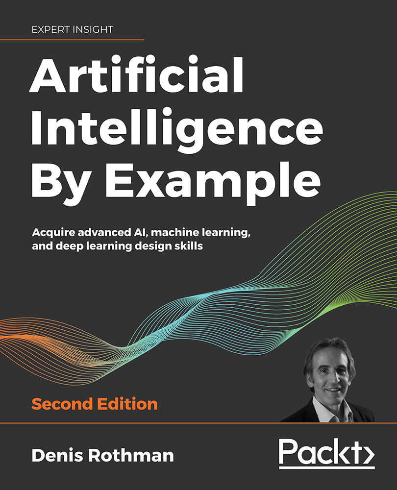

# Artificial Intelligence By Example - Second Edition
This is the code repository for Artificial Intelligence By Example, Second Edition, published by [Packt](https://www.packtpub.com/?utm_source=github). It contains all the supporting project files necessary to work through the book from start to finish.

* **Paperback**: 578 pages
* **ISBN-13**: 9781839211539
* **Date Of Publication**: 28 Feb 2020

[](https://www.amazon.com/Artificial-Intelligence-Example-advanced-learning-ebook/dp/B084ZNNBNN/)

## Links

* [Amazon](https://www.amazon.com/Artificial-Intelligence-Example-advanced-learning-ebook/dp/B084ZNNBNN/)
* [Packt Publishing](https://www.packtpub.com/programming/artificial-intelligence-by-example-second-edition)

## About the Book
AI has the potential to replicate humans in every field. Artificial Intelligence By Example, Second Edition serves as a starting point for you to understand how AI is built, with the help of intriguing and exciting examples.

This book will make you an adaptive thinker and help you apply concepts to real-world scenarios. Using some of the most interesting AI examples, right from computer programs such as a simple chess engine to cognitive chatbots, you will learn how to tackle the machine you are competing with. You will study some of the most advanced machine learning models, understand how to apply AI to blockchain and Internet of Things (IoT), and develop emotional quotient in chatbots using neural networks such as recurrent neural networks (RNNs) and convolutional neural networks (CNNs).

This edition also has new examples for hybrid neural networks, combining reinforcement learning (RL) and deep learning (DL), chained algorithms, combining unsupervised learning with decision trees, random forests, combining DL and genetic algorithms, conversational user interfaces (CUI) for chatbots, neuromorphic computing, and quantum computing.

By the end of this book, you will understand the fundamentals of AI and have worked through a number of examples that will help you develop your AI solutions.

## Instructions and Navigation
All of the code is organized into folders that are named chapter-wise, for example: CH01.

The code will look like the following:
```
loaded_model = keras.models.load_model(directory+"model/model3.h5")
print(loaded_model.summary())
```

## Software Requirements

Check this file for the chapter-wise requirements: [Technical Requirements.csv](./.other/Technical%20Requirements.csv)

## Related Products

* [AI Crash Course](https://www.packtpub.com/data/ai-crash-course)
* [Artificial Intelligence with Python - Second Edition](https://www.packtpub.com/data/artificial-intelligence-with-python-second-edition)
